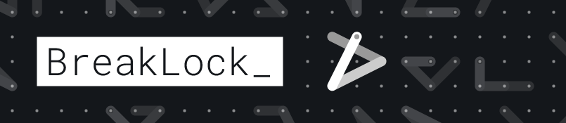

### Bring me to the **[game](https://maxwellito.github.io/breaklock/)**!

Silly HTML5 game, mobile first.
BreakLock is a hybrid of Mastermind and the Android pattern lock. A game you gonna love to hate.

Hopefully this game (codebase included) will drive you mad.

The goal of this project was the discover progressive Web apps with service workers, and play with Webpack. Also to entertain because the tube is quite boring, especially the Central line on peak time.

If you like this game, you must convince 3 people to like it, who will have to convince 3 other people...  and this project will turn into the first OSS sect. Also, if you hate it, you must convince 3 people to hate it, who will have to convince 3 other people...

As long as GitHub provide these sweet gh-pages, this project will be under MIT, without ads, free. 

If you're curious about pattern combinations, run `./lab/bruteCalc.js`.

## Contribute

Contributions are welcome, especially pull-requests. There are a lot of ideas to implement, but less people when it come to code. This is why **issues are for bugs only**.

## Build

```bash
# Install packages
npm install

# Build it
npm run build
```